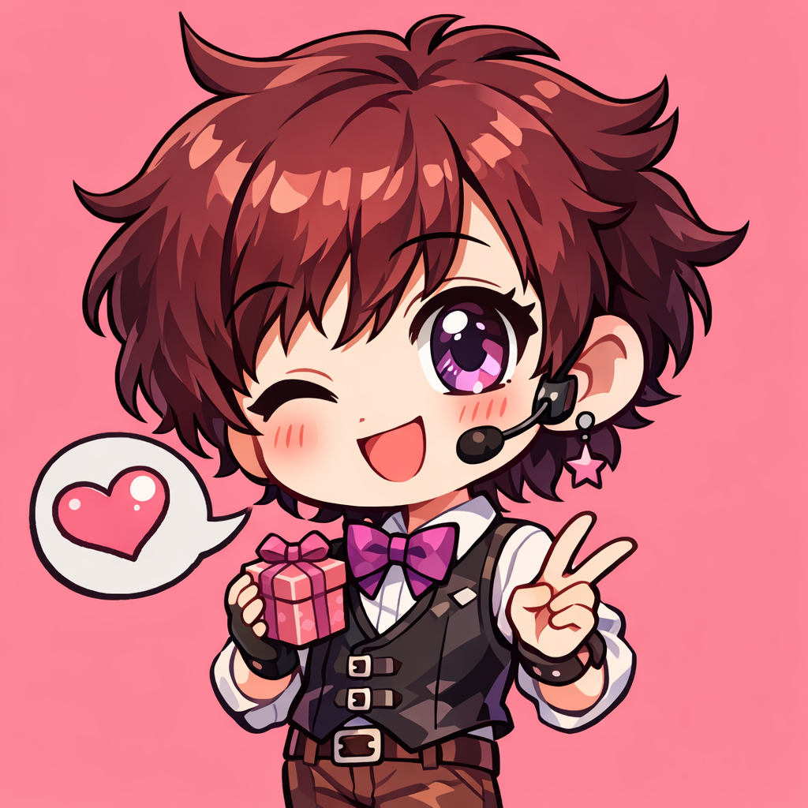
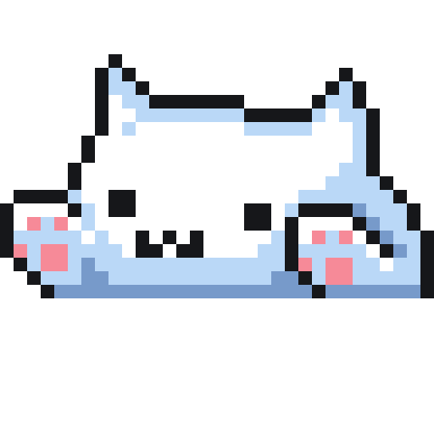

<h1 align="center">😎 RK Studios</h1>

<table width="100%">
<tr>
<td width="65%" valign="top">

Hi 👋! I'm RK ... and I'm a normal highschooler , I'm currently operating from my parents basement ...

 

  

 

  
  
  
  

</td>

<td width="35%" align="center">

</td>
</tr>
</table>

 

<!-- ACTIVITY GRAPH -->

  

 

  
  
  

 

  

⚡ Basement Powered Development

